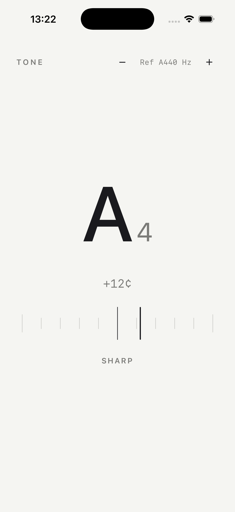
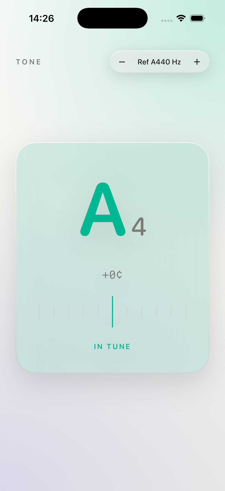
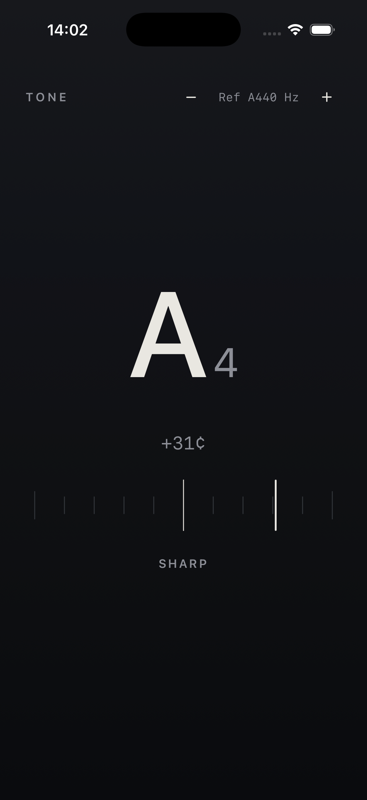
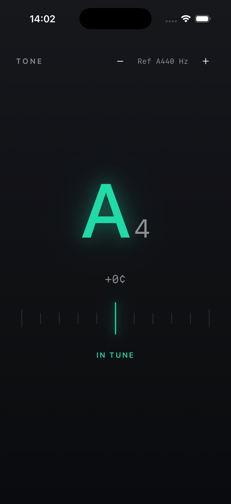

# Tone

広告ゼロ・完全オフラインの iOS クロマチックチューナー。スイス派ミニマルデザイン。

差別化は機能ではなく、**無広告・無課金・即起動・1 画面完結 + design craft**。市場の主要チューナーが抱える「広告地獄・基本機能のペイウォール・bloatware」の対極を志向する。

## デザイン

スイス派(国際タイポグラフィ様式)を基調に、チューナーを **計測器の定規**として表現する。

- 中央 0、±50 セントの hairline 目盛り。cents に比例して細い indicator が動く。
- monochrome(ink / paper、light・dark 適応)+ **単一のアクセント色**。アクセントは **in-tune(|cents| ≤ 3)の瞬間だけ**現れ、音名・indicator・中央目盛りが一斉に signal 色へ「ロック」する。
- **dark は「夜の計測器」**。上方光のグラデーションで奥行きを与え、ロックの瞬間だけ signal が emissive に灯る。boldness は in-tune の 1 点に集中させ、それ以外は monochrome の規律を保つ。increase-contrast / reduce-transparency では奥行き・発光を畳み、純粋な可読性へ倒す。
- 丸いダイヤル / ゲージ(チューナー UI の定番)は採用しない。線形セントの方が読みやすく、より Swiss。
- 余白主体。音名・オクターブ・セントずれ・定規・基準ピッチのみ。

## スクリーンショット

**Light**

| チューニング中(sharp) | in-tune(ロック) |
|---|---|
|  |  |

**Dark**

| チューニング中(sharp) | in-tune(発光ロック) |
|---|---|
|  |  |

in-tune の瞬間だけ音名・indicator・中央目盛りが単一アクセント色へ収束する。dark では深い graphite に対して signal が emissive に灯り、ロックを計測器の「点灯」として表現する。

## アーキテクチャ

ドメインロジック(`TuningProcessor` / `NoteConverter`)を SwiftUI・AudioKit から分離し、`PitchEngine` / `Clock` / `ReferencePitchStore` を protocol 注入してテスト可能にする。

```
App (ToneApp)  ── 具象を注入
  └─ TunerScreen (ToneUI)        SwiftUI 1 画面 / engine 非依存
       ↕ 観測
     TunerViewModel (ToneCore)   @MainActor @Observable / state machine
       ├─ PitchEngine  ──▶ AudioKitPitchEngine (ToneAudio, iOS)  ※差替点
       ├─ TuningProcessor (純) ── NoteConverter, セント空間 EMA, 無音, in-tune
       ├─ ReferencePitchStore ──▶ UserDefaultsReferencePitchStore
       └─ Clock ──▶ MonotonicClock
```

SPM ターゲット構成:

| ターゲット | 役割 | プラットフォーム |
|---|---|---|
| `ToneCore` | ドメイン値型 / ロジック / protocol(AudioKit・SwiftUI 非依存) | iOS / macOS(`swift test` 可能) |
| `ToneAudio` | `AudioKitPitchEngine`(AVAudioSession / PitchTap) | iOS |
| `ToneUI` | SwiftUI views(engine 非依存) | iOS / macOS |
| app shell | `@main ToneApp` + Info.plist + アセット | iOS(Xcode project) |

## ビルド / 実行

```bash
# ドメインロジックの単体テスト(macOS)
swift test

# iOS app の Xcode project を生成(SSOT は project.yml、.xcodeproj は生成物)
brew install xcodegen   # 未導入なら
xcodegen generate
open Tone.xcodeproj      # Xcode で実機 / simulator 実行
```

DEBUG ビルドは `--tone-demo`(任意で `--tone-demo-hz=<value>`)起動引数で擬似入力を流し、実機マイク無しで表示を確認できる。

## プライバシー

完全オフライン。ネットワーク・アカウント・解析を一切持たない。第三者 SDK(広告・解析)を含めない。マイク音声は端末内処理のみで録音・送信しない。App Privacy は「データ収集なし」(`App/PrivacyInfo.xcprivacy`)。

## Status

- M1 ドメインロジック + テスト: 完了(受け入れ基準 AC1–12,14、`swift test`)
- M2 AudioKit 統合 + Foundation 具象: 完了(iOS コンパイル検証 / 死角レビュー済み、実機ピッチ確認は未)
- M3 SwiftUI UI + app shell: 完了(simulator 検証済み、App Store 提出物の一部は残)

## License

MIT — [LICENSE](LICENSE)。

ピッチ検出に [AudioKit](https://github.com/AudioKit/AudioKit) / [SoundpipeAudioKit](https://github.com/AudioKit/SoundpipeAudioKit)(MIT)。構造の参考に [ZenTuner](https://github.com/jpsim/ZenTuner) / [TunePro](https://github.com/timdubbins/TunePro)。
